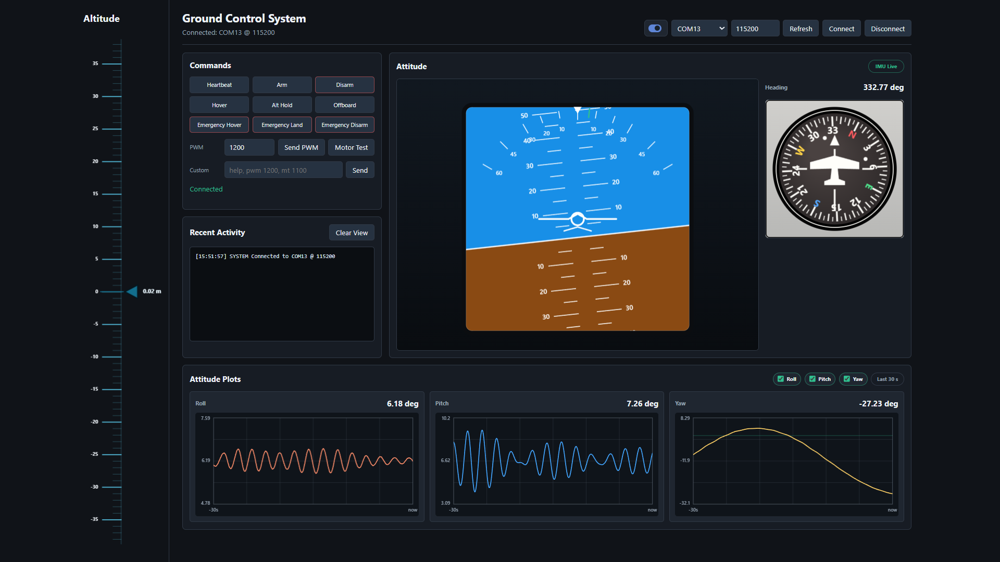

# Ground Control System

Nano ESP32에 연결된 RF/시리얼 데이터를 노트북에서 받아 웹 UI로 확인하는 로컬 Ground Control System입니다. Flask 서버가 노트북에서 실행되고, 브라우저는 이 서버에 접속해서 명령 전송과 텔레메트리 시각화를 합니다.



## Requirements

- Python 3
- Nano ESP32 USB 연결
- Python 패키지:

```powershell
pip install -r requirements.txt
```

## Run On Laptop

노트북에서만 UI를 볼 때는 기본 실행으로 충분합니다.

```powershell
python .\server.py
```

브라우저에서 아래 주소를 엽니다.

```text
http://127.0.0.1:5000
```

5000 포트가 이미 사용 중이면 다른 포트를 지정합니다.

```powershell
python .\server.py --web-port 5001
```

## View From Phone

핸드폰에서 보려면 노트북과 핸드폰이 같은 Wi-Fi에 있어야 합니다. `localhost` 또는 `127.0.0.1`은 각 기기 자기 자신을 뜻하므로 핸드폰에서는 노트북의 Wi-Fi IP로 접속해야 합니다.

1. 노트북 IP를 확인합니다.

```powershell
ipconfig
```

`무선 LAN 어댑터 Wi-Fi`의 `IPv4 주소`를 확인합니다. 예를 들어 `192.168.96.239`처럼 표시됩니다.

2. Flask 서버를 외부 기기에서도 접속 가능하게 실행합니다.

```powershell
python .\server.py --host 0.0.0.0
```

3. 핸드폰 크롬에서 아래 형식으로 접속합니다.

```text
http://노트북_IP:5000
```

예:

```text
http://192.168.96.239:5000
```

Windows 방화벽 팝업이 뜨면 Python 또는 Flask 서버의 네트워크 접근을 허용해야 합니다.

## Serial Connection

1. Arduino IDE Serial Monitor를 닫습니다.
2. 웹 UI에서 Nano ESP32의 COM 포트를 선택합니다.
3. Baud rate는 기본값 `115200`을 사용합니다.
4. `Connect`를 누릅니다.
5. 명령 버튼을 누르거나 `Custom` 입력창에 직접 명령을 입력합니다.

시작할 때 바로 시리얼 포트에 연결하려면 COM 포트와 baud rate를 지정할 수 있습니다.

```powershell
python .\server.py --port COM8 --baud 115200
```

핸드폰에서도 보고 싶고 시작 시 시리얼 포트까지 바로 연결하려면 옵션을 같이 사용합니다.

```powershell
python .\server.py --host 0.0.0.0 --port COM8 --baud 115200
```

## Commands

| UI | Sent command |
| --- | --- |
| Heartbeat | `hb` |
| Arm | `arm` |
| Disarm | `disarm` |
| Hover | `hover` |
| Alt Hold | `althold` |
| Alt Hold with target | `althold CM` |
| Offboard | `offboard` |
| Emergency Hover | `ehover` |
| Emergency Land | `eland` |
| Emergency Disarm | `edisarm` |
| Send PWM | `pwm N` |
| Set Altitude | `alt CM` |
| Motor Test | `mt N` |

## Troubleshooting

- 핸드폰에서 접속이 안 되면 `python .\server.py --host 0.0.0.0`으로 실행했는지 확인합니다.
- 핸드폰과 노트북이 같은 Wi-Fi에 있는지 확인합니다. 모바일 데이터에서는 노트북의 사설 IP로 접속할 수 없습니다.
- Windows 방화벽에서 Python 접근을 허용했는지 확인합니다.
- COM 포트가 보이지 않으면 USB 케이블을 다시 연결하거나 UI의 `Refresh`를 누릅니다.
- Arduino IDE Serial Monitor와 이 GCS는 같은 COM 포트를 동시에 사용할 수 없습니다.
- 연결은 됐지만 반응이 없으면 `Recent Activity`에서 `TX`, `RX`, `[TX CMD] ... result=ok` 로그를 확인합니다.
