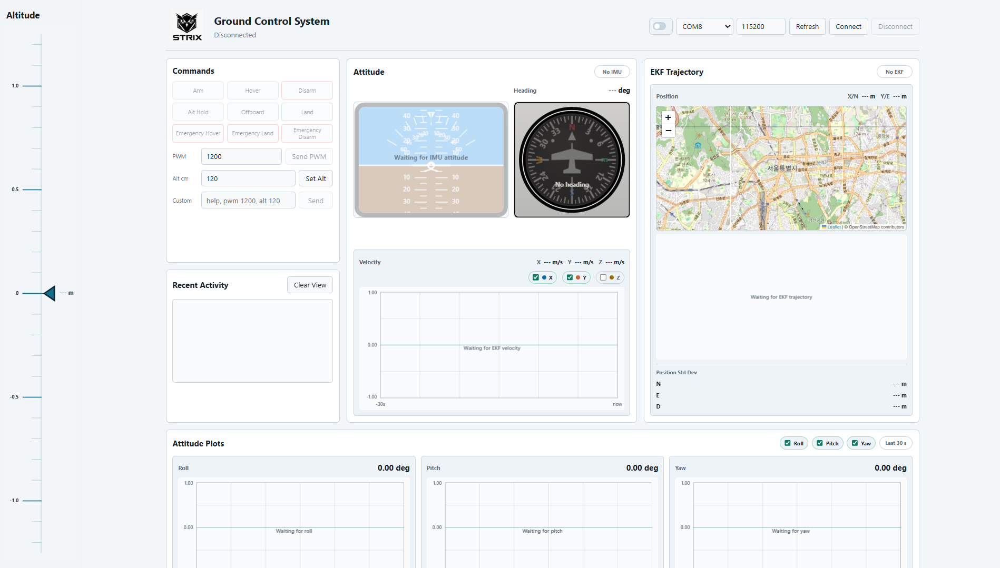

# Ground Control System

Nano ESP32 기반 GCS 보드와 시리얼로 연결해서 드론 명령을 보내고, IMU/GNSS 텔레메트리를 브라우저에서 확인하는 로컬 웹 GCS입니다.

## 현재 화면



## 화면 구성

| 영역 | 설명 |
| --- | --- |
| Altitude | 현재 고도를 세로 테이프 형태로 보여줍니다. 값은 `m` 단위입니다. |
| 상단 연결 영역 | 테마 전환, COM 포트 선택, baud rate 설정, 포트 새로고침, 연결/해제를 합니다. |
| Commands | Arm, Disarm, Hover, Alt Hold, Land 같은 기본 동작을 버튼으로 실행합니다. |
| PWM | PWM 값을 입력해서 `pwm N` 명령을 보냅니다. |
| Custom | 직접 텍스트 명령을 입력해서 보낼 수 있습니다. 예: `help`, `pwm 1200` |
| Attitude | IMU roll/pitch/yaw 값을 인공수평계와 heading 계기로 표시합니다. |
| Recent Activity | TX/RX 로그와 최근 시스템 메시지를 보여줍니다. |
| Attitude Plots | Roll, Pitch, Yaw 값을 최근 30초 그래프로 보여줍니다. |

## 실행 방법

Python 3가 필요합니다.

```powershell
cd C:\Users\임현우\Desktop\Git\GroundControlSystem
python --version
pip install -r requirements.txt
python server.py
```

브라우저에서 아래 주소를 엽니다.

```text
http://127.0.0.1:5000
```

5000 포트가 이미 사용 중이면 다른 포트를 지정합니다.

```powershell
python server.py --web-port 5001
```

실행하면서 바로 시리얼 포트에 연결하려면 COM 포트와 baud rate를 지정합니다.

```powershell
python server.py --port COM8 --baud 115200
```

가상환경을 쓰려면 아래처럼 실행합니다.

```powershell
python -m venv .venv
.\.venv\Scripts\Activate.ps1
pip install -r requirements.txt
python server.py
```

## Windows 데스크톱 앱

QGroundControl처럼 별도 창으로 실행하려면 데스크톱 앱 런처를 사용할 수 있습니다. 내부적으로는 로컬 Flask 서버를 띄운 뒤 WebView 창에서 UI를 엽니다.

개발 환경에서 실행합니다.

```powershell
pip install -r requirements-app.txt
python .\desktop_app.py
```

EXE와 설치 프로그램을 빌드합니다.

```powershell
.\scripts\build_windows.ps1
```

빌드 결과는 `dist\GroundControlSystem\GroundControlSystem.exe`에 생성됩니다. Inno Setup이 설치되어 있으면 `dist\installer\GroundControlSystemSetup.exe`도 생성됩니다. 자세한 내용은 `docs\windows-app.md`를 참고합니다.

## 사용 순서

1. Arduino IDE Serial Monitor를 닫습니다.
2. `python server.py`로 웹 서버를 실행합니다.
3. 브라우저에서 `http://127.0.0.1:5000`을 엽니다.
4. 포트 목록에서 Nano ESP32의 COM 포트를 선택합니다.
5. Baud rate를 `115200`으로 둡니다.
6. `Connect`를 누릅니다.
7. 필요한 명령 버튼을 누르거나 `Custom` 입력창에 직접 명령을 입력합니다.

## 주요 명령

| UI | 전송 명령 |
| --- | --- |
| Arm | `arm` |
| Disarm | `disarm` |
| Hover | `hover` |
| Alt Hold | `althold` |
| Alt Hold with target | `althold CM` |
| Offboard | `offboard` |
| Land | 현재 PWM 값에서 `1350`까지 `pwm N`을 서서히 전송 |
| Emergency Hover | `ehover` |
| Emergency Land | `eland` |
| Emergency Disarm | `edisarm` |
| Send PWM | `pwm N` |
| Set Altitude | `alt CM` |

## 참고

- Arduino IDE Serial Monitor와 이 웹 GCS는 같은 COM 포트를 동시에 사용할 수 없습니다.
- 포트가 보이지 않으면 `Refresh`를 누르거나 USB 케이블을 다시 연결합니다.
- 연결은 됐는데 반응이 없으면 `Recent Activity`에서 `TX`, `RX`, `[TX CMD] ... result=ok` 로그를 확인합니다.
